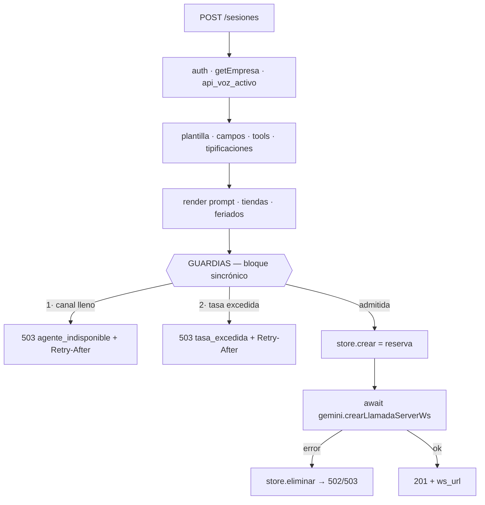

# Guardias anti-runaway — diseño

Diseño de las dos guardias que faltan en `crearSesion` para que el gateway no
pueda volver a entrar en la espiral del 16-jul-2026:

1. **Tope de concurrencia por empresa** (`empresa.canal`) — reponer el que se
   retiró en `ba7e364`.
2. **Límite de tasa de apertura de sesiones** — nuevo, no existió nunca.

Contexto y números: [capacidad-gemini-live.html](capacidad-gemini-live.html),
secciones 5 y 8. Resumen de lo que importa acá:

- El techo es **18,75 sesiones nuevas/minuto** (150.000 TPM ÷ ~8.000 tokens de
  setup por llamada).
- El colapso es un **lazo de realimentación**: una sesión rechazada muere a los
  3 s en vez de 56 s, el operador se libera antes y remarca → más aperturas →
  más rechazos.
- **Un tope de concurrencia NO corta ese lazo.** El 16-jul el tope de 15 estaba
  activo y funcionando: los 15 espacios se reciclaron 63 veces por minuto. Lo
  que corta el lazo es limitar la **tasa**, porque no depende de cuánto duren
  las llamadas.

> **Alcance: solo código.** No se crean ni modifican columnas de BD.
> `empresa.canal` ya existe con valores cargados (Credicash=15, alfin=3,
> efectiva=3) y se lee **tal cual está**. Bajar Credicash de 15 a 9 —lo que
> recomienda el análisis— es una decisión operativa **posterior y separada**,
> que además requiere verificar si otro consumidor de la tabla `empresa` sigue
> leyendo esa columna. Este cambio no depende de esa verificación.

## Por qué el límite de tasa es el que importa

Un rechazo nuestro (503 en el POST) es **gratis**: no abre sesión Gemini, no
manda prompt, no consume un solo token de TPM. Un rechazo de Gemini
(`RESOURCE_EXHAUSTED`) **ya pagó** los ~8.000 tokens del setup.

Esa asimetría es todo el diseño: aunque el marcador de Target ignore el
`Retry-After` y nos martille a 63 POST/min, absorbemos la ráfaga sin quemar
cuota, y las sesiones que sí admitimos se completan sanas. Sin esta guardia, esos
mismos 63 intentos se convierten en 504.000 tokens/min = 336 % de la cuota.

## Punto único de control

Ambas guardias van en **un solo bloque** dentro de `crearSesion`, inmediatamente
antes de `store.crear` (`sesiones.controller.js:117`).



**Por qué ahí y no antes.** El bloque tiene que ser **sincrónico y adyacente a
`store.crear`**, sin ningún `await` en el medio. Node es monohilo: mientras no
haya `await`, chequear-y-reservar es atómico. Si la guardia se evaluara temprano
(justo después de `getEmpresa`) y `store.crear` ocurriera varios `await` después,
N requests concurrentes pasarían todas el chequeo antes de que ninguna se
registrara — y el caso que nos importa es exactamente ése: **17 sesiones en
10 segundos**. La guardia se rompería justo en la ráfaga que debe frenar.

Es el mismo razonamiento que ya documentaba el código viejo: *"Reserva del canal:
registramos la sesión como pendiente ANTES del await"*.

**Costo aceptado:** un rechazo paga primero las queries de plantilla/campos/
tipificaciones y los fetch de tiendas/feriados (decenas de ms). A cambio, la
guardia es correcta bajo ráfaga, que es el único escenario que importa. Un
fast-fail temprano (chequeo no autoritativo apenas se tiene `empresa`) queda
como optimización posterior, **no** como reemplazo del chequeo atómico.

## Guardia 1 — tope de concurrencia (`empresa.canal`)

Cuántas sesiones simultáneas le aceptamos a una empresa.

| Aspecto | Decisión |
|---------|----------|
| Fuente del límite | `empresa.canal`, leído en `getEmpresa` (agregar la columna al SELECT) |
| Semántica de `0` / `NULL` | **Sin límite** — preserva la semántica del código viejo (`canal <= 0`) y hace el cambio inerte para empresas sin valor cargado |
| Qué se cuenta | Sesiones de **esa empresa** con `estado !== "finalizada"` en esta instancia |
| Liberación | `cerrar()` marca `finalizada` sincrónicamente (`geminiEngine.js:267`) y borra del store (`:354`) |

`store.contarActivas()` hoy es **global** (suma todas las empresas) y solo se usa
para la traza del log. Hace falta `contarActivasPorEmpresa(idEmpresa)`.

**Fuga acotada, por diseño.** Una sesión creada por POST cuyo integrador nunca
conecta el WSS ocupa un canal hasta que `purgarExpiradas` la limpia: ventana de
30 s, barrido cada 15 s → **hasta ~45 s**. Bajo ráfaga esto hace el tope
*más* conservador (rechaza antes), que es la dirección correcta del error. No se
toca.

## Guardia 2 — límite de tasa de apertura

Cuántas sesiones nuevas admitimos. **Balde de tokens** (30-jul-2026; reemplazó a
la ventana deslizante del primer despliegue): cada empresa tiene un balde de
capacidad `rafaga` que se repone a razón de `rpm/60` tokens por segundo; cada
apertura consume 1 token y sin token rebota.

**Por qué se reemplazó la ventana.** La ventana deslizante acotaba el sostenido
(15/min sobre cualquier ventana de 60 s, incluso a caballo del borde de minuto),
pero **no la ráfaga instantánea**: 15 sesiones en 8 segundos entraban todas,
porque la ventana arrancaba vacía — y eso fue literalmente el disparador del
16-jul (17 sesiones en 10 segundos). El balde separa las dos cosas que la
ventana fundía en un solo número:

| Parámetro | Controla | Default |
|-----------|----------|---------|
| `MAX_RAFAGA_POR_EMPRESA` (capacidad) | cuánto entra **de golpe** | 5 |
| `MAX_RPM_POR_EMPRESA` (refill) | cuánto entra **sostenido** por minuto | 15 |

Cota: en cualquier lapso de T segundos entran a lo sumo `rafaga + rpm·T/60`.
Con los defaults, el escenario del 16-jul (15 llegadas en 8 s) admite 6 y rebota
9, donde la ventana admitía las 15. El peor primer minuto es `rafaga + rpm` = 20.
El refill es continuo (no hay bordes de minuto), así que la propiedad de la
ventana deslizante que importaba —no permitir 2× el límite a caballo del borde—
se conserva.

### El límite es POR EMPRESA

`MAX_RPM_POR_EMPRESA` es el máximo de sesiones nuevas por minuto que puede abrir
**cada empresa**, no un tope global del gateway: con el valor en 15, diez
empresas pueden generar 150 aperturas/min entre todas y ninguna se rechaza,
porque cada una lleva su propio contador. El sufijo va en el nombre para que no
se lea como global.

### Cuándo se consume un token

`admitir()` consume el token **en el momento de admitir**, dentro del mismo
bloque sincrónico. Un rechazo no consume ni registra nada: el refill sigue
corriendo igual, así que un bucle de reintentos no atrasa la reposición.

| Situación | ¿Consume? |
|-----------|-----------|
| `400 variables_incompletas` | No — nunca llega al bloque |
| Rechazo por canales | No — el tope de canales se chequea **antes** |
| Rechazo por tasa | No — el rebote no descuenta |
| Admitida, y después falla `crearLlamadaServerWs` | **Sí**, deliberado |

El orden entre las dos guardias no es casual: como `admitir()` consume al
admitir, si se chequeara la tasa primero un rechazo por canales igual habría
gastado un token.

El último caso también es a propósito: aunque `store.eliminar` libere el canal,
ese intento **ya llegó a Gemini y ya pagó tokens**. Devolver el cupo invitaría a
reintentar justo cuando la cuota está saturada.

### Parámetro: env ahora, BD después

`MAX_RPM_POR_EMPRESA`, default **15** (80 % de la cuota con el prompt actual).

> **La guardia queda activa sin configurar nada.** Credicash genera hoy ~16,1
> RPM en operación normal, así que con 15 se le rechaza **~7 % de los intentos**
> desde el primer despliegue. Es un recorte chico y deliberado — pero es un
> cambio de comportamiento en producción, no un cambio inerte. Para no tocar su
> operación, 17; para más margen ante ráfagas, 13.

El `0` **no tiene significado especial**: se descartó darle uno porque es
ambiguo —se puede leer igual de bien como "apagá la guardia" o como "cero
llamadas por minuto, rechazá todo"— y ninguna de las dos lecturas justifica el
riesgo de que alguien acierte la equivocada. Es un valor que no hay que escribir.
`admitir()` trata cualquier límite no positivo como config inválida y **deja
pasar** la sesión: ante una config rota es preferible quedarse sin guardia (el
estado de ayer) antes que dejar a la empresa sin atender llamadas.

El día que una empresa necesite valores propios, salen de columnas
`empresa.max_rpm` / `empresa.max_rafaga` nullables con fallback al env — el
mismo patrón que el repo ya usa para `empresa.gemini_api_key`. Para que esa
migración sea trivial, **el módulo no lee configuración**: recibe `rpm` y
`rafaga` ya resueltos, y toda la decisión vive en dos líneas del controller.

```js
// HOY
const limiteRpm = env.maxRpmPorEmpresa;
const rafaga = env.maxRafagaPorEmpresa;

// MAÑANA (+ agregar las columnas al SELECT de getEmpresa)
const limiteRpm = empresa.max_rpm ?? env.maxRpmPorEmpresa;
const rafaga = empresa.max_rafaga ?? env.maxRafagaPorEmpresa;
```

**`??` y no `||`.** Un `0` cargado en BD significa "a esta empresa no le apliques
límite"; con `||` ese 0 caería al valor del env y haría lo contrario de lo
pedido. (Con `canal` da igual: ahí NULL y 0 significan lo mismo.)

No se crea la columna todavía, ni una capa de resolución de configuración: la
línea suelta ya es la costura, y migrar después son 2 líneas.

Referencia para calibrar (prompt ~8.000 tokens, cuota 150.000 TPM):

| Valor | % cuota | Efecto sobre Credicash (hoy 16,1 RPM) |
|-------|---------|----------------------------------------|
| 17 | 91 % | no rechaza nada hoy, pero opera al filo del techo |
| 15 | 80 % | recorta ~7 % de los intentos |
| 13 | 69 % | zona objetivo del análisis; recorta ~19 % |
| 10 | 53 % | máxima protección, pero asume bajar a 9 operadores; con 15 rechaza ~38 % |

## Contrato HTTP

Ambos rechazos: **503 + `Retry-After: 30`**, distinguibles por el campo `codigo`
del body.

| Caso | HTTP | `codigo` | `msg` |
|------|------|----------|-------|
| Concurrencia llena | 503 | `agente_indisponible` | `Sin canales disponibles. Reintente en unos segundos.` |
| Tasa excedida | 503 | `tasa_excedida` | `Limite de llamadas nuevas por minuto alcanzado. Reintente en unos segundos.` |

> **Resuelto (guardia 1, implementada).** Se restauró el contrato **exacto** que
> se retiró en `ba7e364` — `agente_indisponible`, no un `codigo` nuevo — para no
> romper integradores que ya lo manejan. La guardia 2 sí estrena `tasa_excedida`
> porque es un caso que nunca existió.

**Por qué 503 y no 429.** 429 es semánticamente más correcto para la tasa, pero
el integrador ya maneja el camino 503 + `Retry-After` (era la respuesta del tope
viejo y es la del `agente_indisponible` actual). Introducir un status nuevo
arriesga que el marcador lo trate como error duro y **descarte el lead** en vez
de reintentar. El `codigo` en el body da la distinción máquina-legible sin tocar
el contrato de status codes. Revisar
[contrato-post-sesiones.html](contrato-post-sesiones.html) al implementar.

## Observabilidad

Sin BD, mismo criterio que `metricasCierre.js`: que se vea en el log.

```
[sesiones] RECHAZADO 503 sin canales empresa=8 ocupacion=15/15
[sesiones] RECHAZADO 503 tasa excedida empresa=8 aperturas=15/15 en 60s
```

Un rechazo silencioso acá es una llamada que suena sin IA del otro lado — el
comentario que ya encabeza el helper `err()`. Ambos rechazos pasan por `err()`,
que ya loguea, más la línea de detalle con ocupación/tasa.

Contador agregado periódico (estilo `metricasCierre`, resumen cada 5 min) queda
como opcional del mismo PR.

## Archivos tocados

| Archivo | Cambio |
|---------|--------|
| `src/lib/tasaSesiones.js` | **nuevo** — balde de tokens en memoria (nació como ventana deslizante; reemplazada el 30-jul) |
| `src/sessions/store.js` | + `contarActivasPorEmpresa(idEmpresa)` |
| `src/models/agenteVoz.model.js` | `getEmpresa`: agregar `canal` al SELECT |
| `src/controllers/sesiones.controller.js` | las dos guardias antes de `store.crear` |
| `src/config/env.js` | + `maxRpmPorEmpresa` (default 0) |
| `.env.example` | + `MAX_RPM_POR_EMPRESA=0` |

### API de `tasaSesiones.js`

```js
// Chequeo y registro en UNA operación: un caller no puede admitir y olvidarse
// de registrar. `ahora` inyectable para que los tests no duerman.
admitir(idEmpresa, limite, ahora = Date.now()) -> { ok, usados, limite }

usados(idEmpresa, ahora)   // solo lectura, para logs y tests
purgar(ahora)              // descarta empresas sin aperturas vigentes
```

Guarda un array de timestamps por empresa, podando los > 60 s en cada consulta.
Acotado por el propio límite (~15-30 entradas por empresa). `limite <= 0` =
desactivado, misma semántica de escape que `canal <= 0`.

## Tests

Ambos módulos son puros: se testean sin BD ni WS, con reloj inyectado.

`test/tasaSesiones.test.js` (reloj inyectado, sin `sleep`)
- admite hasta el límite y rechaza el siguiente
- la ventana **desliza**: rechazada en t=59 s, admitida en t=61 s
- ráfaga a caballo del borde de minuto **no** permite 2× el límite (el caso que
  falla con ventana fija — es el test que justifica el diseño)
- `limite = 0` desactiva la guardia y no acumula estado
- **empresas independientes no se pisan** (verifica que el límite es por empresa)
- el rechazo en bucle no acumula timestamps viejos
- `purgar` descarta empresas sin aperturas vigentes

`test/topeConcurrencia.test.js`
- `contarActivasPorEmpresa` no mezcla empresas
- `finalizada` no cuenta; `pendiente`/`conectada`/`en_curso` sí
- `canal = 0` / `NULL` = sin límite

## Límites conocidos

- **La cuota de Gemini es por API key, no por empresa.** Hoy solo Credicash tiene
  `gemini_api_key` propia; el resto cae al `GEMINI_API_KEY` global
  ([keys-gemini-por-empresa.md](keys-gemini-por-empresa.md)). Para esas empresas
  los contadores son independientes pero **la cuota que consumen es compartida**:
  con el límite en 15, dos empresas sobre la key global suman 30 aperturas/min =
  240.000 TPM contra una cuota de 150.000, y Gemini rechaza aunque ninguna haya
  tocado su tope. No es un defecto del diseño, es su alcance: **cubre el runaway
  de una empresa, no la suma de empresas sobre una key compartida**. Se cierra
  completando el rollout de keys por empresa. Mientras tanto, calibrar contando
  cuántas empresas cuelgan de la key global.
- **Una sola instancia.** Ambas guardias son en memoria y por proceso. Con N
  réplicas en EasyPanel el límite efectivo es N×. `store.js` ya arrastra esta
  nota; si se escala, ambas guardias se van a Redis junto con el store.
- **No reemplazan al backoff del marcador** (recomendación #6, lado Target). Sin
  él la recuperación es más lenta, pero nuestros rechazos son gratis, así que la
  espiral de TPM no se sostiene.
- **No reducen el consumo por llamada.** La palanca de mayor impacto sigue siendo
  compactar el prompt de la plantilla 139 (recomendación #3), que es trabajo de
  contenido, no de este repo.

## Estado

- [x] **Guardia de concurrencia (`empresa.canal`)** — restauración fiel, hecha
      2026-07-30 (`6370cab`). `canal` vuelve al SELECT de `getEmpresa`; nuevo
      `store.contarActivasPorEmpresa` (el `contarActivas` existente es global y
      habría mezclado empresas); guardia en `crearSesion` pegada a `store.crear`.
      Tests en `test/topeConcurrencia.test.js`.
      Los valores de BD **no se tocaron**: Credicash sigue en 15.
- [x] **Guardia de tasa (`MAX_RPM_POR_EMPRESA`)** — hecha 2026-07-30. Nació como
      ventana deslizante de 60 s y el mismo día se reemplazó por **balde de
      tokens** (`MAX_RAFAGA_POR_EMPRESA`, default 5): la ventana no frenaba la
      ráfaga instantánea, que fue el disparador real del 16-jul. Chequeo en
      `crearSesion` después del de canales. Tests en `test/tasaSesiones.test.js`.
      **Defaults 15 rpm / 5 ráfaga: activa desde el despliegue.**
- [ ] Actualizar `contrato-post-sesiones.html` con los códigos de rechazo
      (`agente_indisponible` por canales, `tasa_excedida` por tasa)
- [ ] *(operativo)* Confirmar el valor de `MAX_RPM_POR_EMPRESA` en producción:
      15 recorta ~7 % de los intentos de Credicash; 17 no toca su operación
- [ ] *(operativo, aparte)* Bajar `empresa.canal` de Credicash 15 → 9, previa
      verificación de otros lectores de la columna
- [ ] *(futuro)* Columna `empresa.max_rpm` cuando una segunda empresa necesite un
      valor propio — 2 líneas: el SELECT y el `??` en `crearSesion`
